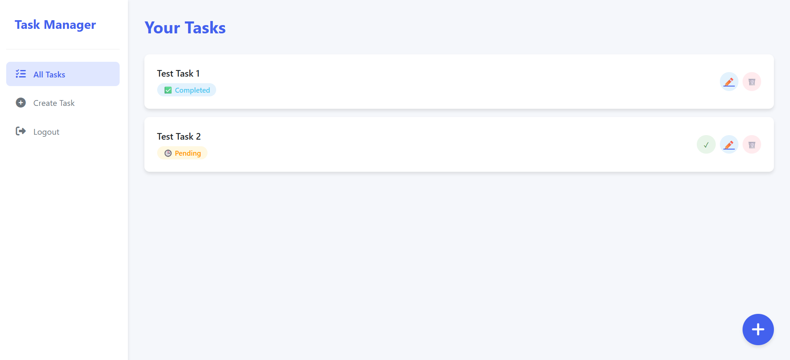
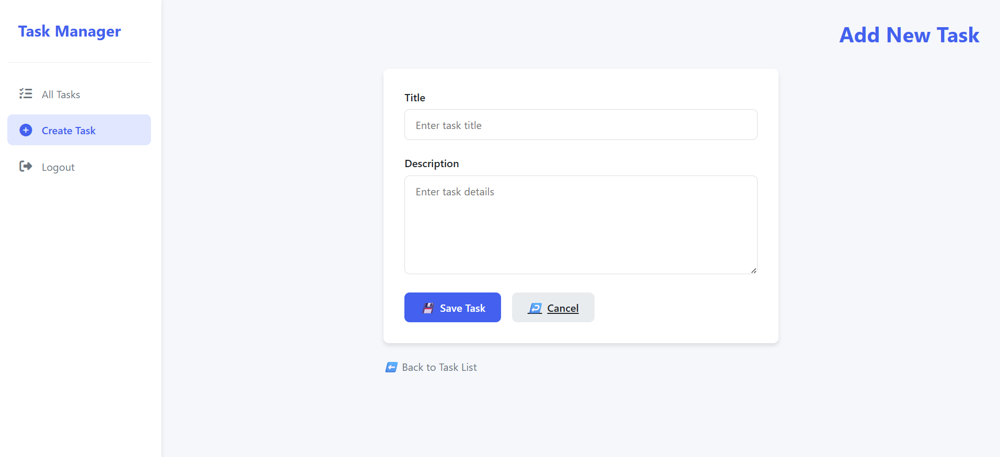
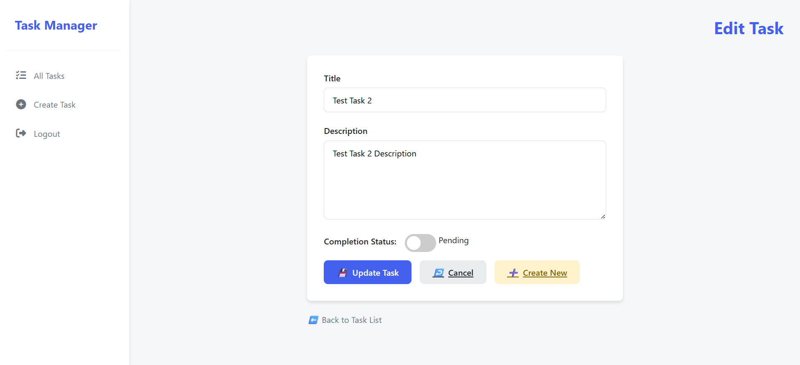

# 📝 Laravel To-Do App

A task manager built with Laravel and Breeze, allowing users to register, log in, and manage their tasks (create, update, mark as completed, and delete).

---
---

## 📷 Screenshots

### 🔐 Login Screen


### 📝 Register Screen


### 🏠 Home / Task List


### ➕ Create Task


### ✏️ Edit Task



## 🚀 Features

- User authentication (login/register) via Laravel Breeze  
- Create, view, edit, delete tasks  
- Mark tasks as completed  
- Authorization to ensure users can only edit their own tasks  


---

## 📦 Requirements

- PHP >= 8.2  
- Composer  
- Laravel >= 10.x  
- Node.js and NPM (for frontend assets, optional)  
- MySQL or SQLite (or any database Laravel supports)

---

## ⚙️ Installation

### 1. Clone the repository

```bash
git clone https://github.com/your-username/your-todo-app.git
cd your-todo-app
```

### 2. Install dependencies

```bash
composer install
```

### 3. Copy the `.env` file and configure

```bash
cp .env.example .env
```

Edit the `.env` file and set your database configuration:

```env
DB_CONNECTION=mysql
DB_HOST=127.0.0.1
DB_PORT=3306
DB_DATABASE=todo-webapp
DB_USERNAME=root
DB_PASSWORD=
```

### 4. Generate app key

```bash
php artisan key:generate
```

### 5. Run migrations

```bash
php artisan migrate
```

### 6. (Optional) Install Laravel Breeze for authentication

If not already installed:

```bash
composer require laravel/breeze --dev
php artisan breeze:install
npm install && npm run build
php artisan migrate
```

---

## ▶️ Run the Project

```bash
php artisan serve
```

Visit: [http://127.0.0.1:8000](http://127.0.0.1:8000)

---

## 🧪 Default Routes

- `/` — redirects to login or task list  
- `/tasks` — view your tasks  
- `/tasks/create` — add new task  
- `/tasks/{id}/edit` — edit task

---

## ✅ Auth Credentials (Test)

You can register as a new user or manually insert one into the database.

---

## 📁 Folder Structure

- `app/Models/Task.php` — Task model  
- `app/Http/Controllers/TaskController.php` — Task logic  
- `resources/views/tasks/` — Blade templates (standalone HTML)  
- `routes/web.php` — Route definitions

---

## 🙏 Credits

- Laravel  
- Laravel Breeze  
- Font Awesome (for icons)

---

## 📄 License

This project is open-source and available under the [MIT license](LICENSE).
